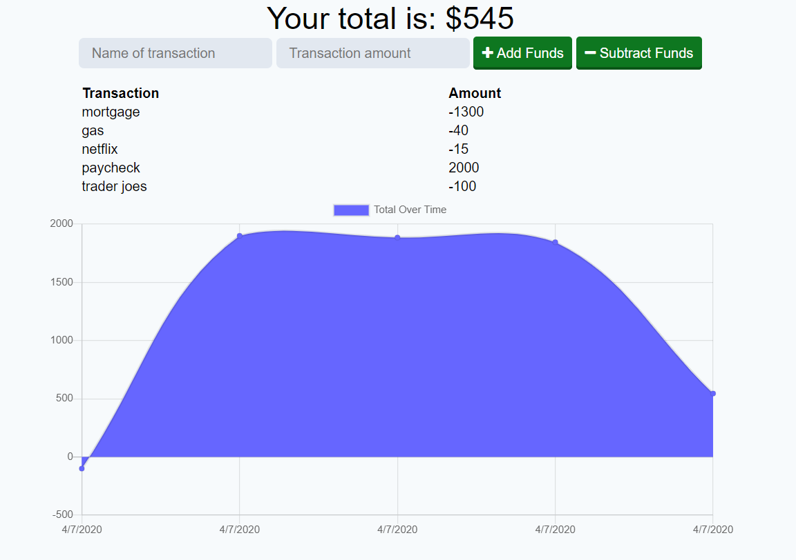

# Challenge 19

## User Story

AS AN avid traveller
I WANT to be able to track my withdrawals and deposits with or without a data/internet connection
SO THAT my account balance is accurate when I am traveling

## Description

a budget tracker application that allows for offline access and functionality

## Installation

Clone to your local machine and open in your favorite code editor. Open a bash terminal and do an "npm install" to get the node modules. Then type "node server.js" to run the application. Click on the link to open the program in local host.

## Technologies Utilized

    "compression": "^1.7.4",
    "express": "^4.17.1",
    "lite-server": "^2.5.3",
    "mongoose": "^5.5.15"
    "morgan": "^1.9.1

### Screenshot

## Links

[budget-tracker](link goes here)
